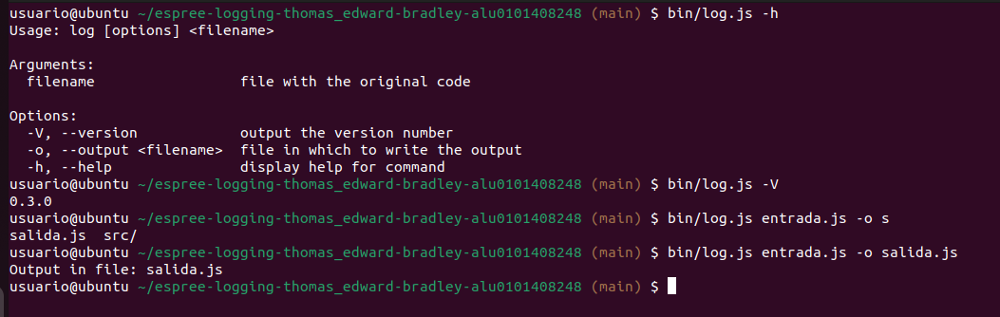
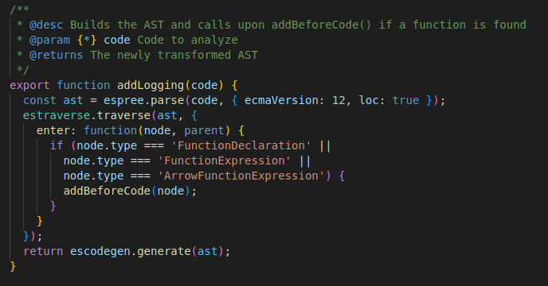
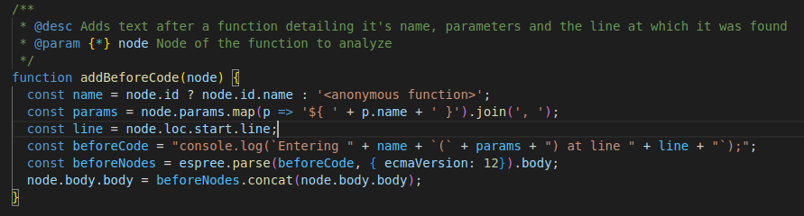
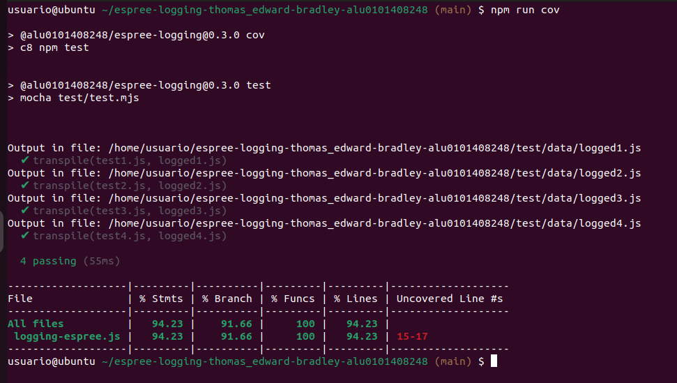
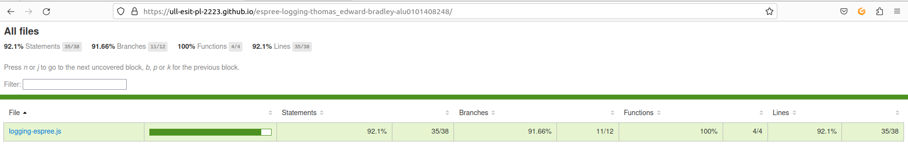
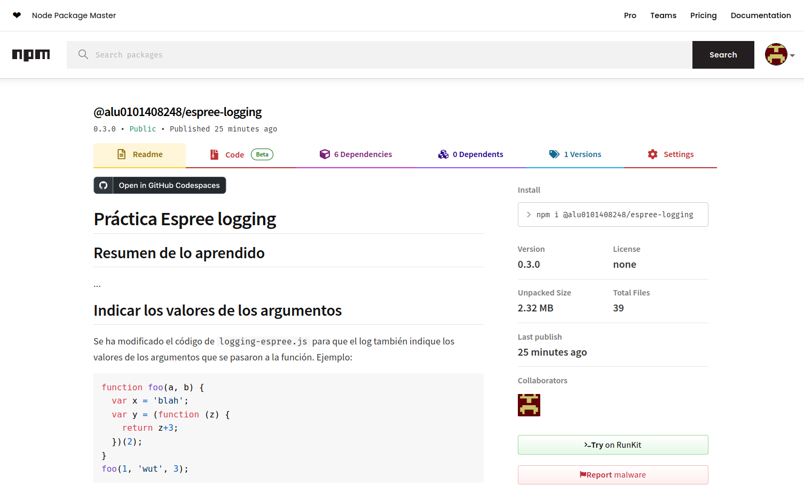

# Práctica Espree logging

Thomas Edward Bradley  
alu0101408248  
03/03/23 

## Instalar dependencias

Para inicializar el repositorio, se tiene que escribir por linea de comandos:  
```bashrc
npm i
```

## Indicar los valores de los argumentos

Se ha modificado el código de `logging-espree.js` para que el log también indique los valores de los argumentos que se pasaron a la función. 
Ejemplo:

```javascript
function foo(a, b) {
  var x = 'blah';
  var y = (function (z) {
    return z+3;
  })(2);
}
foo(1, 'wut', 3);
```

```javascript
function foo(a, b) {
    console.log(`Entering foo(${ a }, ${ b })`);
    var x = 'blah';
    var y = function (z) {
        console.log(`Entering <anonymous function>(${ z })`);
        return z + 3;
    }(2);
}
foo(1, 'wut', 3);
```

## CLI con [Commander.js](https://www.npmjs.com/package/commander)

Se ha implementado commander para incorporar las opciones -h / --help, -V / --version y -o / --output:  
  

## Reto 1: Soportar funciones flecha

Para soportar funciones flecha, solo hace falta incluir que estas se detecten dentro del bucle for en addLogging():  
  

## Reto 2: Añadir el número de línea

Para imprimir el numero de linea tenemos que meter el resultado de "node.loc.start.line" dentro del console log que 
le pasamos (esta imprimira la misma):  
  

## Tests and Covering

Se añadio un test ademas, el cual el programa tambien supera:  
  

Aqui esta una captura de la pagina mostrando los resultados de los tests:   
  
[Pagina Web](https://ull-esit-pl-2223.github.io/espree-logging-thomas_edward-bradley-alu0101408248/)  

## Module in npm

Para ello se ha creado una cuenta en npm y se ha hecho login con esta desde una terminal.   
Despues, el package.json tiene una script "publish" para subir el modulo a dicha cuenta.  
  

Aqui se encuentra el link al paquete npm del proyecto:   
[@alu0101408248/espree-logging](https://www.npmjs.com/package/@alu0101408248/espree-logging?activeTab=readme)  

# JSDOC to Markdown

## Functions

<dl>
<dt><a href="#transpile">transpile(inputFile, outputFile)</a></dt>
<dd><p>Observes the output options and puts the code returned by addLogging() in the output specified</p>
</dd>
<dt><a href="#addLogging">addLogging(code)</a> ⇒</dt>
<dd><p>Builds the AST and calls upon addBeforeCode() if a function is found</p>
</dd>
<dt><a href="#addBeforeCode">addBeforeCode(node)</a></dt>
<dd><p>Adds text after a function detailing it&#39;s name, parameters and the line at which it was found</p>
</dd>
</dl>

<a name="transpile"></a>

## transpile(inputFile, outputFile)
Observes the output options and puts the code returned by addLogging() in the output specified

**Kind**: global function  

| Param | Type | Description |
| --- | --- | --- |
| inputFile | <code>\*</code> | File containing the original code |
| outputFile | <code>\*</code> | File in which to stick the new code |

<a name="addLogging"></a>

## addLogging(code) ⇒
Builds the AST and calls upon addBeforeCode() if a function is found

**Kind**: global function  
**Returns**: The newly transformed AST  

| Param | Type | Description |
| --- | --- | --- |
| code | <code>\*</code> | Code to analyze |

<a name="addBeforeCode"></a>

## addBeforeCode(node)
Adds text after a function detailing it's name, parameters and the line at which it was found

**Kind**: global function  

| Param | Type | Description |
| --- | --- | --- |
| node | <code>\*</code> | Node of the function to analyze |

<br />

[](https://classroom.github.com/open-in-codespaces?assignment_repo_id=10307982)